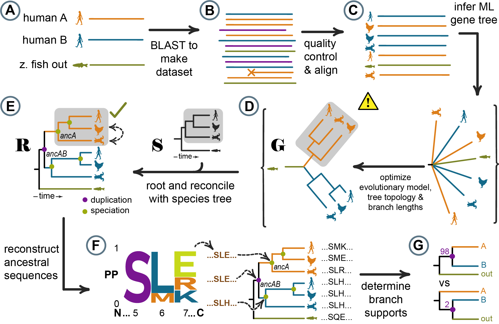

# topiary

   

[Documentation](https://topiary-asr.readthedocs.io/en/latest/)

### Python framework for doing ancestral sequence reconstruction.

Publication forthcoming in *Protein Science*. Stay tuned. 

#### Pipeline automated by topiary

#### Features

+ *Automatic.* Performs sequence database construction, quality
  control, multiple sequence alignment, tree construction, gene/species tree
  reconciliation, and ancestral reconstruction with minimal user input.
+ *Species aware.* Integrates with the [Open Tree of Life](https://tree.opentreeoflife.org/opentree/argus/opentree13.4)
  database, improving selection of sequences and tree/ancestor inference.
+ *Human-oriented.* Users prepare input as spreadsheets, not
  arcane text files. Outputs are spreadsheets, clean fasta files, pdf trees,
  and graphical summaries of ancestor quality.
+ *Flexible.* Use as a command line program or do custom analyses
  and plotting with the API.
+ *Modern.* Topiary is built around a collection of modern,
  actively-supported, phylogenetic software tools:

  + [OpenTree](https://opentree.readthedocs.io/en/latest/)
  + [muscle 5](https://www.drive5.com/muscle/)
  + [RAxML-NG](https://github.com/amkozlov/raxml-ng)
  + [GeneRax](https://github.com/BenoitMorel/GeneRax)
  + [PastML](https://pastml.pasteur.fr)
  + [toytree](https://toyplot.readthedocs.io/)

#### Try it out Google Colab

+ [Go from a few initial sequences to a full alignment](https://githubtocolab.com/harmslab/topiary-examples/blob/main/notebooks/01_seed_to_alignment.ipynb)
+ [Build a phylogenetic tree and reconstruct ancestors](https://githubtocolab.com/harmslab/topiary-examples/blob/main/notebooks/03_alignment_to_ancestors.ipynb)

