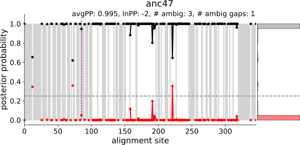

.. topiary documentation master file, created by
   sphinx-quickstart on Thu Aug 12 18:37:04 2021.

.. include:: links.rst

.. role:: emph

.. _index-doc:

=======
topiary
=======

Python framework for doing ancestral sequence reconstruction.

Features
========

+ :emph:`Automatic.` Performs sequence database construction, quality
  control, multiple sequence alignment, tree construction, gene/species tree
  reconciliation, and ancestral reconstruction with minimal user input.
+ :emph:`Species aware.` Integrates with the `Open Tree of Life`_
  database, improving selection of sequences and tree/ancestor inference.
+ :emph:`Human-oriented.` Users prepare input as spreadsheets, not
  arcane text files. Outputs are spreadsheets, clean fasta files, pdf trees,
  and graphical summaries of ancestor quality.
+ :emph:`Flexible.` Use as a command line program or do custom analyses
  and plotting using the topiary API.
+ :emph:`Modern.` Topiary is built around a collection of modern,
  actively-supported, phylogenetic software tools:
  `OpenTree <opentree-link_>`_,
  `muscle 5 <muscle-link_>`_, `RAxML-NG <raxml-ng-link_>`_,
  `GeneRax <generax-link_>`_, `PastML <pastml-link_>`_, and `toytree <toytree-link_>`_.

Example input/output
====================

:emph:`User input to a topiary calculation`

+------+--------------------------------------------------------------------------------------------+---------------+------------+
| name | aliases                                                                                    | species       | sequence   |
+------+--------------------------------------------------------------------------------------------+---------------+------------+
| LY96 | ESOP1;Myeloid Differentiation Protein-2;MD-2;lymphocyte antigen 96;LY-96                   | Homo sapiens  | MLPFLFF... |
+------+--------------------------------------------------------------------------------------------+---------------+------------+
| LY96 | ESOP1;Myeloid Differentiation Protein-2;MD-2;lymphocyte antigen 96;LY-96                   | Danio rerio   | MALWCPS... |
+------+--------------------------------------------------------------------------------------------+---------------+------------+
| LY86 | Lymphocyte Antigen 86;LY86;Myeloid Differentiation Protein-1;MD-1;RP105-associated 3;MMD-1 | Homo sapiens  | MKGFTAT... |
+------+--------------------------------------------------------------------------------------------+---------------+------------+
| LY86 | Lymphocyte Antigen 86;LY86;Myeloid Differentiation Protein-1;MD-1;RP105-associated 3;MMD-1 | Danio rerio   | MKTYFNM... |
+------+--------------------------------------------------------------------------------------------+---------------+------------+

:emph:`Final output tree from a small example topiary calculation`

.. image:: _static/img/final-tree.svg
  :align: center
  :alt: Topiary tree drawing

:emph:`Example ancestor quality summary graph`

Quick start
===========

The topiary pipeline has two stages:

1. Going from seed sequence to alignment (blasting, sequence quality control,
   reducing redundancy, and alignment). This can be run on a user's windows,
   macOS, or linux computer.
2. Going from alignment to ancestors (building a gene tree, reconciling with the
   species tree, inferring ancestors, and calculating bootstraps). This requires
   macOS or linux; windows is *not* supported. This step should usually be run
   on a high performance computing cluster.

Installation
------------

See the :ref:`installation<installation-doc>` page.

.. commenting ...

  topiary can be easily installed with conda.

  .. code-block:: shell-session

    conda create -n topiary topiary-asr -c bioconda
    conda activate topiary

  Windows users and silicon macOS users will need to manually install
  `muscle <muscle-download_>`_ and `blast <blast-download_>`_.

  For full installation instructions, see the :ref:`installation<installation-doc>` page.

Short protocol
--------------

For a more detailed protocol, see the :ref:`protocol<protocol-doc>` page.

#. Create a seed spreadsheet with a handful of sequences that define the scope
   of the ASR study. For examples, see the table above or download
   `full example <_static/data/seed-dataframe_example.csv>`_.

#. Construct a multiple sequence alignment from a the seed spreadsheet
   ("seed.xlsx", for example). This can be run on a local computer or a cluster.

   .. code-block:: shell-session

      topiary-seed-to-alignment seed.xlsx --out_dir output

#. If desired, visually inspect and edit the alignment in an external alignment
   viewer. (We recommend `aliview <aliview-link_>`_.) Load the edited alignment
   into a topiary dataframe.

   .. code-block:: shell-session

      topiary-load-fasta-into output/dataframe.csv edited_fasta final-dataframe.csv

#. Build a species-reconciled phylogenetic tree and infer ancestral sequences.
   This is usually run on a cluster.

   .. code-block:: shell-session

      topiary-alignment-to-ancestors final-dataframe.csv --out_dir ali_to_anc

#. Generate bootstrap replicates to measure branch support. This is usually run
   on a cluster.

   .. code-block:: shell-session

      topiary-bootstrap-reconcile ali_to_anc

How to cite
===========

If you use topiary in your research, please cite:

+ *Citation coming soon.*

Please make sure to cite the tools we use in the package as well:

+ `Muscle <muscle-link_>`_: Edgar RC (2021) *bioRxiv*
  `https://doi.org/10.1101/2021.06.20.449169 <muscle-cite_>`_.
+ `RAxML-NG <raxml-ng-link_>`_: Kozlov et al (2019) *Bioinformatics* 35(21):4453–4455
  `https://doi.org/10.1093/bioinformatics/btz305 <raxml-ng-cite_>`_.
+ `GeneRax <generax-link_>`_: Morel et al (2020) *MBE*
  `https://doi.org/10.1093/molbev/msaa141 <generax-cite_>`_.
+ `PastML <pastml-link_>`_: Ishikawa et al (2019) *MBE* 36(9):2069–2085
  `https://doi.org/10.1093/molbev/msz131 <pastml-cite_>`_.
+ `OpenTree <opentree-link_>`_: Mctavish J et al (2021) *Syst Biol* 70(6): 1295–1301.
  `https://doi.org/10.1093/sysbio/syab033 <opentree-cite_>`_.

API and data structures
=======================

For a detailed description of the data structures and API, see the
:ref:`Data Structures<data-structures-doc>` and :ref:`API<api-doc>` pages.

Topiary uses `pandas <pandas-link_>`_ dataframes to manage phylogenetic data.
These dataframes can be readily written out and read from spreadsheet files
(.csv, .tsv, .xlsx).

Topiary is built around two types of dataframes:

+ :emph:`seed dataframe`: A manually constructed dataframe containing seed sequences
  that topiary uses as input to construct a full topiary dataframe for the
  project.
+ :emph:`topiary dataframe`: The main structure for holding sequences and
  information about those sequences for the project. Each step in the pipeline
  saves out, then edits, the main dataframe. This allows one to follow
  the steps and/or manually introduce changes.

.. toctree::
   :maxdepth: 2
   :caption: Contents:

   installation
   protocol
   drawing
   data_structures
   api

Indices and tables
==================

* :ref:`genindex`
* :ref:`modindex`
* :ref:`search`
