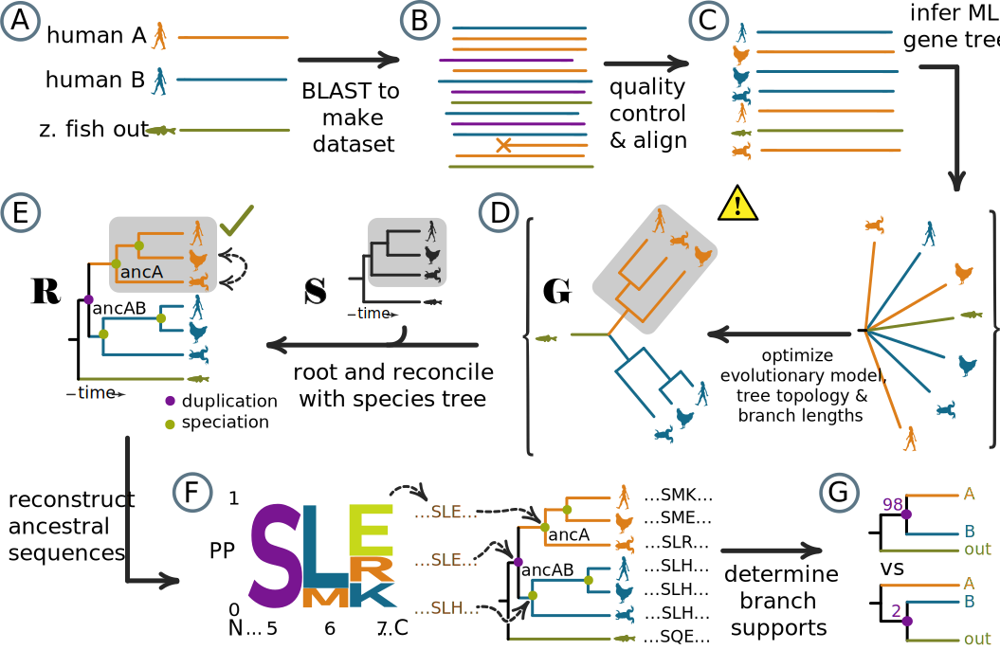
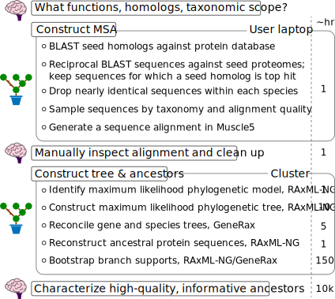
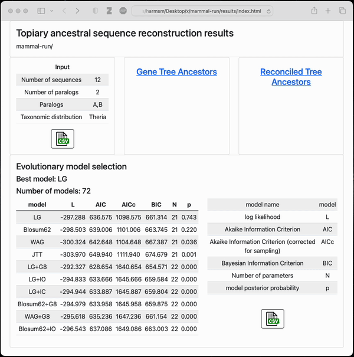

.. topiary documentation master file, created by
   sphinx-quickstart on Thu Aug 12 18:37:04 2021.

.. include:: links.rst

.. role:: emph

.. _index-doc:

=======
topiary
=======

:emph:`Python framework for doing ancestral sequence reconstruction`

Ancestral sequence reconstruction (ASR) is a powerful method to study protein
evolution. It requires constructing a multiple sequence alignment, running a 
software pipeline with several software packages, and converting
between arcane file types. Topiary streamlines this process, simplifying the
workflow and helping non-experts do best-practice ASR. 

Features
========

+ :emph:`Automatic.` Performs sequence database construction, quality
  control, multiple sequence alignment, tree construction, gene/species tree
  reconciliation, and ancestral reconstruction with minimal user input.
+ :emph:`Human-oriented.` Users prepare their input as spreadsheets, not
  complicated text files. Outputs are spreadsheets and graphical summaries of
  ancestor quality.
+ :emph:`Species aware.` Integrates with the `Open Tree of Life`_
  database, improving selection of sequences and tree/ancestor inference.
+ :emph:`Flexible.` Use as a command line program or do custom analyses
  and plotting using the topiary API in a Jupyter notebook or Python script.
+ :emph:`Modern.` Topiary is built around a collection of modern,
  actively-supported, phylogenetic software tools:
  `OpenTree <opentree-link_>`_,
  `muscle 5 <muscle-link_>`_, `RAxML-NG <raxml-ng-link_>`_,
  `GeneRax <generax-link_>`_, `PastML <pastml-link_>`_, and `toytree <toytree-link_>`_.

:emph:`Steps done by topiary`

|

Try it out on Google Colab
==========================

+ `Go from a few initial sequences to a full alignment <https://githubtocolab.com/harmslab/topiary-examples/blob/main/notebooks/seed-to-alignment.ipynb>`_
+ `Build a phylogenetic tree and reconstruct ancestors <https://githubtocolab.com/harmslab/topiary-examples/blob/main/notebooks/alignment-to-ancestors.ipynb>`_

Workflow
========

Topiary automates the computational steps of an ASR calculation, allowing the 
user to focus on the three steps that require human insight: defining the 
problem, validating the alignment, and characterizing the resulting ancestors.
The graphic below shows the steps done by the user (brain icons) versus software
(tree icons) in a topiary calculation. 

|

Example input/output
====================

:emph:`User input to a topiary calculation`

A user prepares a "seed dataframe" setting the scope for the calculation. 

+------+--------------------------------------------------------------------------------------------+---------------+------------+
| name | aliases                                                                                    | species       | sequence   |
+------+--------------------------------------------------------------------------------------------+---------------+------------+
| LY96 | ESOP1;Myeloid Differentiation Protein-2;MD-2;lymphocyte antigen 96;LY-96                   | Homo sapiens  | MLPFLFF... |
+------+--------------------------------------------------------------------------------------------+---------------+------------+
| LY96 | ESOP1;Myeloid Differentiation Protein-2;MD-2;lymphocyte antigen 96;LY-96                   | Danio rerio   | MALWCPS... |
+------+--------------------------------------------------------------------------------------------+---------------+------------+
| LY86 | Lymphocyte Antigen 86;LY86;Myeloid Differentiation Protein-1;MD-1;RP105-associated 3;MMD-1 | Homo sapiens  | MKGFTAT... |
+------+--------------------------------------------------------------------------------------------+---------------+------------+
| LY86 | Lymphocyte Antigen 86;LY86;Myeloid Differentiation Protein-1;MD-1;RP105-associated 3;MMD-1 | Danio rerio   | MKTYFNM... |
+------+--------------------------------------------------------------------------------------------+---------------+------------+

:emph:`Final output from a small example topiary calculation`

After running the pipeline, topiary returns a shareable directory with an html
summary of all results. 

|

Installation
============

See the :ref:`installation<installation-doc>` page.

.. commenting ...

  topiary can be easily installed with conda.

  .. code-block:: shell-session

    conda create -n topiary topiary-asr -c bioconda
    conda activate topiary

  Windows users and silicon macOS users will need to manually install
  `muscle <muscle-download_>`_ and `blast <blast-download_>`_.

  For full installation instructions, see the :ref:`installation<installation-doc>` page.

Short protocol
==============

For a more detailed protocol, see the :ref:`protocol<protocol-doc>` page.

#. Create a seed spreadsheet with a handful of sequences that define the scope
   of the ASR study. For examples, see the table above or download the 
   `full example <_static/data/seed-dataframe_example.csv>`_.

#. Construct a multiple sequence alignment from a the seed spreadsheet
   ("seed.xlsx", for example). This can be run on a local computer or a cluster.

   .. code-block:: shell-session

      topiary-seed-to-alignment seed.xlsx --out_dir output

#. If desired, visually inspect and edit the alignment in an external alignment
   viewer. (We recommend `aliview <aliview-link_>`_.) Load the edited alignment
   into a topiary dataframe.

   .. code-block:: shell-session

      topiary-load-fasta-into output/dataframe.csv edited_fasta final-dataframe.csv

#. Build a species-reconciled phylogenetic tree and infer ancestral sequences.
   This is usually run on a cluster.

   .. code-block:: shell-session

      topiary-alignment-to-ancestors final-dataframe.csv --out_dir ali_to_anc

#. Generate bootstrap replicates to measure branch supports. This is usually run
   on a cluster.

   .. code-block:: shell-session

      topiary-bootstrap-reconcile ali_to_anc num_threads

How to cite
===========

If you use topiary in your research, please cite:

Orlandi KN\ :sup:`*`, Phillips SR\ :sup:`*`, Sailer ZR, Harman JL, Harms MJ. "Topiary: pruning the
manual labor from ancestral sequence reconstruction" (2022) *Protein Science* 
`10.1002/pro.4551 <topiary-link_>`_.

:sup:`*` *Authors contributed equally*

Please make sure to cite the tools we use in the package as well:

+ `Muscle <muscle-link_>`_: Edgar RC (2021) *bioRxiv*
  `https://doi.org/10.1101/2021.06.20.449169 <muscle-cite_>`_.
+ `RAxML-NG <raxml-ng-link_>`_: Kozlov et al (2019) *Bioinformatics* 35(21):4453–4455
  `https://doi.org/10.1093/bioinformatics/btz305 <raxml-ng-cite_>`_.
+ `GeneRax <generax-link_>`_: Morel et al (2020) *MBE*
  `https://doi.org/10.1093/molbev/msaa141 <generax-cite_>`_.
+ `PastML <pastml-link_>`_: Ishikawa et al (2019) *MBE* 36(9):2069–2085
  `https://doi.org/10.1093/molbev/msz131 <pastml-cite_>`_.
+ `OpenTree <opentree-link_>`_: Mctavish J et al (2021) *Syst Biol* 70(6): 1295–1301.
  `https://doi.org/10.1093/sysbio/syab033 <opentree-cite_>`_.

API and data structures
=======================

Topiary can also be used as an API to organize general phylogenetic workflows.
It uses `pandas <pandas-link_>`_ dataframes to manage phylogenetic data,
allowing it to readily connect to other data science pipelines. Further, topiary
provides programmatic access to RAxML-NG, GeneRax, Muscle5, and BLAST (local and
remote). It also wraps portions of the OpenTree and PastML Python APIs for 
convenient interaction with topiary pandas dataframes. 

You can see examples of the topiary API in action inside Jupyter notebooks 
in the `topiary-examples <https://github.com/harmslab/topiary-examples>`_
github repo. For a detailed description of the data structures and API, see the
:ref:`Data Structures<data-structures-doc>` and :ref:`API<api-doc>` pages.

.. toctree::
   :maxdepth: 2
   :caption: Contents:

   installation
   protocol
   pipelines
   taxonomic_scope
   drawing
   data_structures
   api

Indices and tables
==================

* :ref:`genindex`
* :ref:`modindex`
* :ref:`search`

