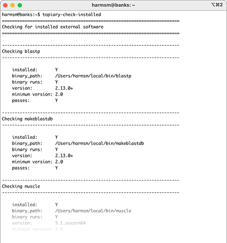

.. include:: links.rst

.. role:: raw-html(raw)
    :format: html

.. _installation-doc:

============
Installation
============

Cross-platform installation instructions
========================================

We recommend using conda to install topiary on all operating systems. (Some
system-specific instructions for installation of wrapped software packages
are in the next sections).

To prevent interference with other packages, we recommend installing topiary in
its own conda environment.If you do not have conda installed, download and
install `miniconda <miniconda-link_>`_ before proceeding. Once conda is installed,
run the following commands in a standard terminal (Linux or macOS) or the
Anaconda Prompt (Windows):

.. code-block:: shell-session

  conda install git
  git clone https://github.com/harmslab/topiary

You can then install topiary via conda:

.. code-block:: shell-session

  cd topiary
  conda config --set channel_priority strict
  conda env create -f environment.yml
  conda activate topiary
  python -m pip install . -vv

At this point, you have topiary, but not the software packages it wraps,
installed. The next sections describe how to install the entire software
stack.

Validate the installation
=========================

You can check which software packages are visible to topiary by:

.. code-block:: shell-session

  topiary-check-installed

The output should look something like this:

:raw-html:` `
If some of the packages are not installed (:code:`passes: N`), proceed to the
sections below.

.. important::

  Windows users must specify the complete path to each script when running
  topiary commands. To run the above command (:code:`topiary-check-installed`)
  please type: :code:`python c:\\users\\harmsm\\topiary\\bin\\topiary-check-installed`,
  replacing the first part of the path (:code:`:c\\users\\harmsm`) with the path
  on your system.

.. _macos-linux-section:

macOS and Linux instructions
============================

You can install the software packages with:

.. code-block:: shell-session

  conda install -c conda-forge -c bioconda "mpi4py" "openmpi<4.1.3" "muscle>=5.0" "raxml-ng>=1.1" "generax>=2.0" "blast>=2.2"

You can then check to make sure everything installed correctly by running:

.. code-block:: shell-session

  topiary-check-installed

If any of these packages were not installed by conda--or you wish to install
them yourself--you can install them manually using the following links:

+ `NCBI blast+ >= 2.2 <blast-download_>`_. (This will install both the blastp and
  makeblastdb programs.)
+ `muscle >= 5.0 <muscle-download_>`_.
+ `GeneRax >= 2.0 <generax-download_>`_.
+ `RAxML-NG >= 1.1 <raxml-ng-download_>`_.

After installation, you'll need to make sure the directories containing these
binaries are in your :code:`$PATH` directory. (See `here <nix-path_>`_ for
instructions).

.. note::

  As of this writing (Summer, 2022), conda will *not* install RAxML-NG, GeneRax,
  muscle, or blast+ on an arm64 mac (aka Apple Silicon, M1, M2, etc.). These
  packages must be installed  manually. The RAxML-NG and GeneRax binaries remain
  experimental, so use with caution.

.. _windows-section:

Windows instructions
====================

.. important::

  RAxML-NG and GeneRax do :emph:`not` run on Windows. To generate trees and
  ancestors, you must run topiary on a Linux or macOS machine. Topiary can be
  used on a local Windows computer to generate an alignment, which can then be
  passed to a Linux or macOS cluster for the ancestral inference. Tree plotting
  can also be run on a Windows machine.

To use topiary on Windows, you need to install two packages:

+ `muscle >= 5.0 <muscle-download_>`_. This binary comes as a single, read-to-run
  file. Download the file and place it in a convenient folder somewhere on
  your computer. :emph:`Rename the file to muscle.exe`.
+ `NCBI blast+ >=2.0 <blast-download_>`_. This is a conventional package
  installer. Follow the on-screen prompts to install the program. This will
  install both the blastp and makeblastdb).

After you have installed blast+ and muscle,
:emph:`close and reopen the Anaconda Prompt`. Then run:

.. code-block:: shell-session

  conda activate topiary
  python c:\Users\USERNAME\topiary\bin\topiary-check-installed

If the *muscle*, *blastp* and/or *makeblastdb* binaries are not found,
you likely need to add the directories containing the blast and muscle binaries
to the :code:`$PATH` variable. This `stackoverflow thread <windows-path_>`_
gives detailed instructions on how to accomplish this. Once you have added the
directories containing muscle and blast+ to the :code:`$PATH` variable,
:emph:`you need to close and reopen your Anaconda Prompt.` Then check to see
if the packages are installed.

.. _install-source-section:

Install from source
===================

If you wish to install the package from source or make changes to the package,
you'll need to clone the repository:

.. code-block:: shell-session

  git clone https://github.com/harmslab/topiary

You can install via conda:

.. code-block:: shell-session

  cd topiary
  conda env create -f environment.yml
  conda activate topiary
  python -m pip install . -vv

Alternatively, you can install via pip:

.. code-block:: shell-session

  cd topiary
  pip install -r requirements.txt

These steps will install topiary, but not the full software stack. If you are on
macOS or Linux, you can install the core software by:

.. code-block:: shell-session

  conda install -c conda-forge -c bioconda "openmpi<4.1.3" "muscle>=5.0" "raxml-ng>=1.1" "generax>=2.0" "blast>=2.2"

If you are on Windows, please see the :ref:`windows section<windows-section>`.

------------------
Required libraries
------------------

+ Core scientific python libraries:

  + `Python >= 3.8 <python-link_>`_
  + `numpy <numpy-link_>`_
  + `pandas <pandas-link_>`_
  + `matplotlib <matplotlib-link_>`_

+ Tree manipulation/drawing:

  + `ete3 <ete3-download_>`_
  + `toytree <toytree-download_>`_
  + `dendropy <dendropy-download_>`_

+ Packages used for tree/ancestor inferences:

  + `NCBI BLAST+ <blast-download_>`_
  + `muscle >= 5.0 <muscle-download_>`_
  + `GeneRax >= 2.0 <generax-download_>`_
  + `RAxML-NG >= 1.1 <raxml-ng-download_>`_
  + `pastml <pastml-link_>`_
  + `python-opentree <opentree-link_>`_
