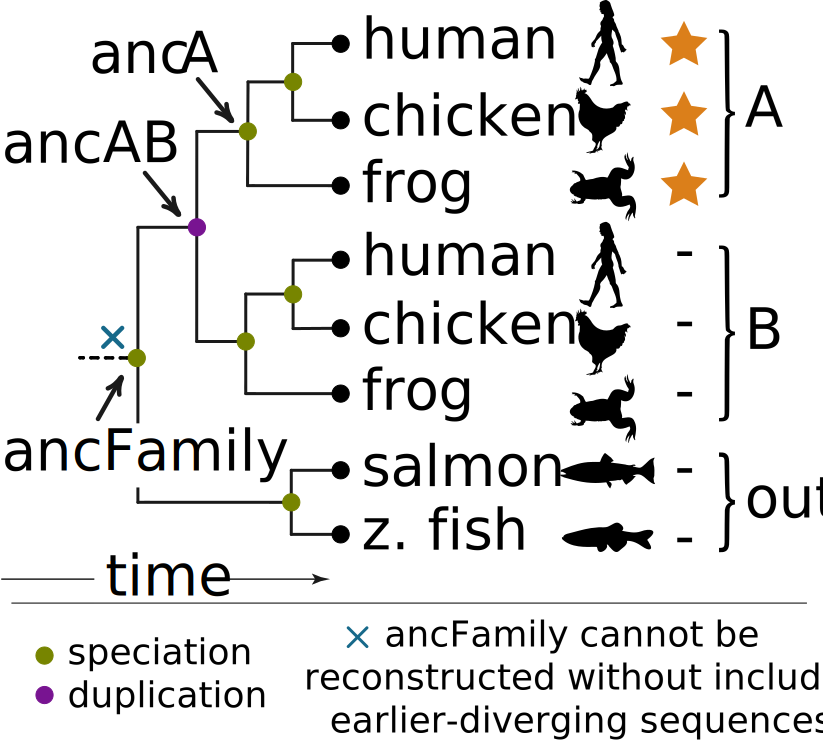
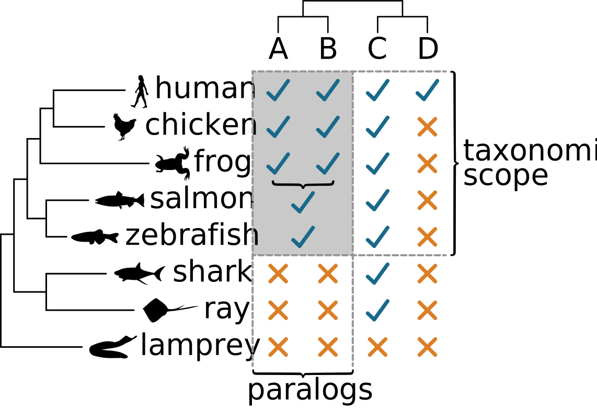
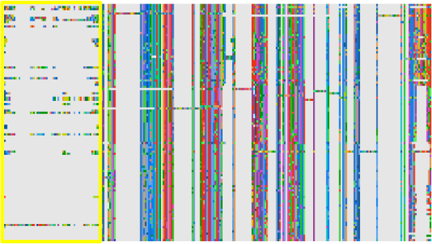
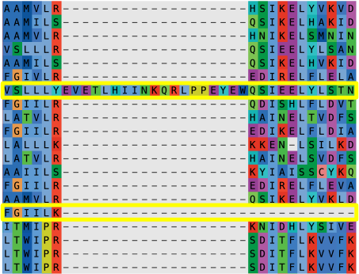
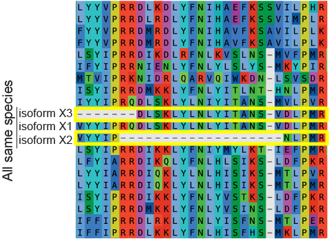
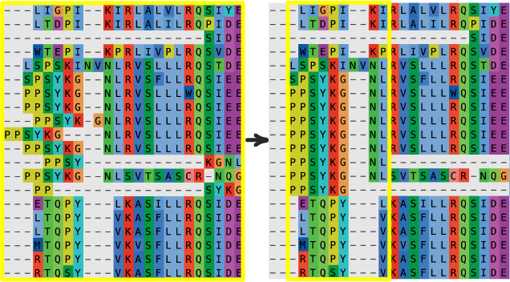

.. role:: emph

.. role:: raw-html(raw)
    :format: html

.. include:: links.rst

.. _protocol-doc:

========
Protocol
========

Define the problem
==================

The most important task in an ASR study is defining the problem. What
ancestors do you want to reconstruct? What modern proteins are best
characterized and most relevant to interpreting the results with ancestors?
This requires expert knowledge of the proteins under study--it's not something
that can be automated.

The tree for a hypothetical protein family shows how one might approach the 
problem. `Paralog <paralogs_>`_ A has some activity (denoted with a star);
paralog B does not. If we are interested in the evolution of the star activity,
we would likely reconstruct ancA and ancAB (arrows). We expect ancA was active
because all of its descendants are active; we expect ancAB was inactive because
only the A paralogs--not the B paralogs or fish proteins--are active. 
Reconstructing ancA and ancAB would thus isolate the key sequence differences
that conferred activity. 

:raw-html:` `
Two pieces of information specify the scope of the ASR study and thus what 
ancestors can be reconstructed:

#. What homologs are of interest? 
#. What homologs exist in what organisms? 

We can think of the answers to these questions graphically. The image below 
shows the information from above in a different format. The protein family is shown
left to right (proteins A-D); the species tree is shown from top to bottom
(humans through lampreys). The blue checks and orange exs indicate whether the 
organism has the protein. To reconstruct ancA and ancAB, we need to know we want
to study proteins *A* and *B* (paralogs of interest) and we need to know that
bony vertebrates, but not other animals, have the A and B proteins
(*taxonomic scope*). The gray box indicates the proteins we need to include in 
our ASR study to reconstruct ancA and ancAB. 

:raw-html:` `
In a topiary calculation, we specify that these are the proteins of interest 
using a seed dataset. In graphical terms, this means finding sequences 
representing all paralogs (across horizontal) taken from the full taxonomic
scope (the top and bottom of the gray box).

-------------------------
1. Prepare a seed dataset
-------------------------

A seed dataset defines the paralogs of interest and taxonomic scope for a 
reconstruction. It has four columns: name (e.g. the paralog), species, aliases,
and sequence. Topiary uses this dataset as a starting point for BLAST searches
to construct a dataset and generate an alignment for the reconstruction study.
An example for the two immune proteins, LY86 and LY96, is shown below. The full
spreadsheet can be downloaded `here <_static/data/seed-dataframe_example.csv>`_.

+------+--------------------------------------------------------------------------------------------+---------------+------------+
| name | aliases                                                                                    | species       | sequence   |
+------+--------------------------------------------------------------------------------------------+---------------+------------+
| LY96 | ESOP1;Myeloid Differentiation Protein-2;MD-2;lymphocyte antigen 96;LY-96                   | Homo sapiens  | MLPFLFF... |
+------+--------------------------------------------------------------------------------------------+---------------+------------+
| LY96 | ESOP1;Myeloid Differentiation Protein-2;MD-2;lymphocyte antigen 96;LY-96                   | Danio rerio   | MALWCPS... |
+------+--------------------------------------------------------------------------------------------+---------------+------------+
| LY86 | Lymphocyte Antigen 86;LY86;Myeloid Differentiation Protein-1;MD-1;RP105-associated 3;MMD-1 | Homo sapiens  | MKGFTAT... |
+------+--------------------------------------------------------------------------------------------+---------------+------------+
| LY86 | Lymphocyte Antigen 86;LY86;Myeloid Differentiation Protein-1;MD-1;RP105-associated 3;MMD-1 | Danio rerio   | MKTYFNM... |
+------+--------------------------------------------------------------------------------------------+---------------+------------+

1.1. Determine what sequences to include
----------------------------------------

#. :emph:`Choose the paralogs of interest for your ASR calculation.` As
   described above, the choice of paralogs determines what evolutionary
   transitions you will reconstruct. In our experience, you'll want to select
   ~1-5 paralogs in your seed dataset. As you add more paralogs, you need more
   sequences to resolve the evolutionary tree, making the calculation
   progressively slower. In the example seed dataset, we selected two paralogs,
   LY86_ and LY96_. 
#. :emph:`Determine the taxonomic distribution of the protein family.` In the
   graphic above, this means identifying the vertical boundaries of the gray 
   box: which creatures have these proteins? This information is often available
   through literature searches. We also recommend 
   :ref:`exploratory BLAST<taxonomic-scope-doc>` searches to identify the
   most evolutionarily distant groups of organisms with the proteins of
   interest. 
#. :emph:`Choose two or three species with well-annotated genomes` that span the
   taxonomic distribution of your proteins of interest. In the graphic above, 
   this means selecting species from the top and bottom of the gray box. The 
   human and zebrafish proteins would be a good choice, as they have
   well-annotated genomes and span the diversity of organisms with the proteins 
   of interest. (Contrast this to selecting humans and chickens, which would only
   include amniote proteins). The NCBI BLAST "Taxonomy" report from the 
   :ref:`exploratory BLAST<taxonomic-scope-doc>` page can be helpful
   in this regard: select organisms that differ at the highest level of the
   reported hierarchy. 

1.2. Construct the seed spreadsheet
-----------------------------------

The seed dataset is a spreadsheet that can be prepared in a spreadsheet program
(Excel or LibreOffice), a text editor, or programmatically via
`pandas <pandas-link_>`_.

#. :emph:`Download sequences for each paralog` from each species and put it into
   the table. Our usual source for these seed sequences is uniprot_. Generally,
   you'll want the `canonical <uniprot-canonical_>`_ sequence rather than an
   isoform. These sequences can come from anywhere; they do not even have to be
   from a database.
#. :emph:`Compile a list of aliases for each paralog`. Annoyingly, the same protein
   can have different names across different databases/species. By using a
   human-curated list of aliases, topiary is more effective at identifying
   sequences that really correspond to the paralogs of interest. When creating
   this list:

   + separate different aliases with "`;`"
   + aliases are case-insensitive (i.e. :code:`MD2`, :code:`md2`, and
     :code:`Md2` are equivalent)
   + topiary automatically tries different separators. For example, for :code:`MD2`
     topiary will look for :code:`MD2`, :code:`MD 2`, :code:`MD-2`, :code:`MD_2`,
     and :code:`MD.2`. It inserts separators between letters and numbers or any
     time there is a space/separator in the alias.
   + make sure to include both the abbreviated and full-length versions of each
     alias (i.e. :code:`MD2` and :code:`myeloid differentiation protein 2`).

   To find aliases, you can check out the "`Also known as`_" field for the gene of
   interest on NCBI, the "`Protein names`_" section of the protein's UniProt
   entry, a "genecards_" entry (for proteins found in humans), and/or primary

   literature.
#. You can put other information about the sequences (accession, citations, etc.)
   as their own columns in the table. Topiary will ignore, but keep, those
   columns.
#. If you would like to include specific sequences in the analysis, you can 
   also add them to the seed dataset. (For example, you might want to make sure
   an experimentally characterized protein from a specific organism is in the
   final tree). To do so, add the the sequence to the dataset like any other, 
   then add a fifth column: :code:`key_species`. Each sequence in the 
   spreadsheet should either have :code:`True` or :code:`False` in this column. 
   Those with :code:`True` will be used as part of the seed dataset; those 
   with :code:`False` will not be used as seeds, but will be kept in all 
   downstream steps in the analysis. 

Generate a Multiple Sequence Alignment
======================================

---------------------------------------------------
2. Generate a draft alignment from the seed dataset
---------------------------------------------------

Generate an alignment on the command line:

.. code-block:: shell-session

  topiary-seed-to-alignment seed-dataframe_example.csv --out_dir seed_to_ali

Output
------

This will create a directory named :code:`seed_to_ali` that has a set of
spreadsheets capturing each step in the topiary pipeline, as well as 
intermediate files used in the calculation. The outputs are described in detail
in the :ref:`Script details <align-script-details>` section. 

.. note::

  Generally, this script should take less than an hour. The time required for
  the initial NCBI BLAST step depends on server capacity and may take a while.
  Unfortunately, this is outside of topiary's control. If this step is too slow
  or crashes, you can load in sequences from saved BLAST XML files as described
  below.

Options
-------

There are many options available for this function. These can be accessed by:

.. code-block:: shell-session

  topiary-seed-to-alignment --help

Some of the more common options users might wish to change are listed below.

:emph:`Controlling alignment size`

The :code:`--seqs_per_column` and :code:`--max_seq_number` arguments control
how many sequences topiary will attempt to place in the final alignment.  By
default, topiary will attempt to have one sequence per amino acid in the
average seed sequence (:code:`--seqs_per_column 1`). For example, if your
average seed is 200 amino acids long, it will  aim for 200 sequences in the
alignment. This can be changed by changing the value of :code:`--seqs_per_column`.
The maximum alignment size is set by :code:`--max_seq_number`. Note that these
values are approximate; the final alignment may be slightly larger or smaller.

:emph:`Choosing different BLAST inputs`

You can select different BLAST inputs via the :code:`--blast_xml`,
:code:`--ncbi_blast_db`, and :code:`--local_blast_db` options. Any combination
of these options may be specified at the same time, allowing a single command to
BLAST against an NCBI database, BLAST against a local BLAST database, and 
load results fromn a collection of previously saved BLAST XML files. The 
:code:`--blast_xml` option is particularly useful, as you can save NCBI BLAST
results from the web interface (for example) and read those files in directly.

:emph:`Restarting`

You can restart a command from an existing directory using a command like the
following:

.. code-block:: shell-session

  topiary-seed-to-alignment seed-dataframe_example.csv --out_dir seed_to_ali --restart

This will find the last *.csv* output file that was written in the 
:code:`seed_to_ali` directory and start the pipeline from there. 

.. _align-script-details: 

Script details
--------------

The script does the following six steps. After each step, topiary writes out the
indicated *.csv* file, allowing one to track what changes are made. Topiary will
add sequences and/or columns at each step. It does not delete sequences, but 
rather sets the :code:`keep` column to :code:`False` when a sequence is removed.

.. tip:: 

  If you want to override topiary's decision to remove a sequence, you can 
  manually set :code:`keep` to :code:`True` in one of the intermediate 
  spreadsheets. Delete the subsequence spreadsheets and then re-run the pipeline
  with the :code:`--restart` argument described above. 

+ :emph:`Finds paralogs from other species` using the seed sequences as BLAST queries
  against the `NCBI non-redundant database <blast-nr_>`_. The taxonomic scope is
  defined by the key species in the seed dataset.

  + Output: *01_initial-dataframe.csv*
  + Function: `topiary.ncbi.ncbi_blast <topiary.ncbi.blast.html#topiary.ncbi.blast.ncbi.ncbi_blast>`_

+ :emph:`Makes orthology calls` using `reciprocal BLAST <https://www.flyrnai.org/RNAi_orthology.html>`_
  against the proteomes of the key species from the seed dataset.

  + Output: *02_recip-blast-dataframe.csv*
  + Function: `topiary.ncbi.recip_blast <topiary.ncbi.blast.html#topiary.ncbi.blast.recip.recip_blast>`_

+ :emph:`Decreases the size of the dataset` taking into account taxonomic sampling,
  quality, and alignment score of all sequences.

  + Output: *03_shrunk-dataframe.csv*
  + Function: `topiary.shrink_dataset <topiary.quality.html#topiary.quality.shrink.shrink_dataset>`_

+ :emph:`Generates a draft alignment` using `Muscle5 <muscle-link_>`_.

  + Output: *04_aligned-dataframe.csv*
  + Function: `topiary.align <topiary.muscle.html#topiary.muscle.muscle.align>`_

+ :emph:`Polishs alignment` by removing worst aligning sequences.

  + Output: *05_clean-aligned-dataframe.csv*
  + Function: `topiary.quality.polish_alignment <topiary.quality.html#topiary.quality.polish.polish_alignment>`_

+ :emph:`Writes alignment in fasta format` for loading into an alignment viewer.

  + Output: *06_alignment.fasta*
  + Function: `topiary.write_fasta <topiary.io.html#topiary.io.alignments.write_fasta>`_

-----------------------------------------------------
3. Visually inspect and (possibly) edit the alignment
-----------------------------------------------------

Before reconstructing a phylogenetic tree and ancestors, we recommend
inspecting and possibly editing the alignment. We recommend using

`Aliview <aliview-link_>`_ for this purpose. There are differing views on
whether or not to manually edit an alignment. Manual edits are subjective, but
there are also "obvious" instances where automatic alignment software does
poorly. We usually edit our alignments using the following protocol. 
:emph:`If you modify your alignment manually, it should be

included in any publication so others can reproduce/evaluate your work.` We
recommend including the final topiary *.csv* file as a supplemental file with 
your manuscript, as this has all sequence accessions and the final alignment in
a single table.

.. danger::

  When editing the alignment, do not change the names of the sequences as this
  is how topiary maps the alignment back into the dataframe. Likewise, do not
  add sequences to the alignment. (To add sequences, you should add them to the
  dataframe itself before writing out the alignment.)

:emph:`Trim variable-length N- and C-terminal regions from the alignment`.
A huge number of sparse and variable columns will slow evolutionary analyses and
will generally not provide enough signal to be reconstructed with confidence.

:raw-html:` `
:emph:`Delete sequences with long, unique insertions or deletions (indels)`.
Indels can lead to alignment ambiguity around flanking regions. Further, they
provide no information for most ancestors, most of whom do not have the indel,
while increasing the computational cost of the phylogenetic analysis. Note,
do not make internal edits to sequences (say, by deleting a long
lineage-specific insertion) as this becomes difficult to track or justify upon
future realignment steps.

:raw-html:` `
:emph:`Delete lineage-specific duplicates.` Select the sequence with the
greatest sequence coverage. The pipeline generally does a good job of deleting
sequences in this class; however, if such sequences slip through, delete them
from the alignment.

:raw-html:` `
:emph:`Globally realign the sequences`. Because trying to align long and
variable sequences like those we deleted above can affect the alignment of
other sequences, we generally use Muscle5 to re-align the entire dataset
after we remove problematic sequences and columns. Alignment can be done directly
within AliView. We often iterate through the steps above and full realignment
several times.

:emph:`Carefully inspect the alignment and correct "obvious" local misalignments`.
Shift characters, without deleting characters, to correct identical or nearly
identical regions that are misaligned. This can occur at the edges of insertions
and deletions.

:raw-html:` `
Once you are satisfied with the alignment, save it out as a .fasta file from
your alignment editor.

Load the final alignment into the dataframe
-------------------------------------------

Once you have edited the alignment, load the new alignment back into a new,
final topiary dataframe.

.. code-block:: shell-session

  topiary-fasta-into-dataframe 05_clean-aligned-dataframe.csv edited_alignment.fasta final_dataframe.csv

In this command, :code:`edited_alignment.fasta` should be the name of the fasta
file you saved out above. :code:`final_dataframe.csv` is the name of the final
csv file.

Infer tree and ancestors
========================

------------------------------------------
4. Infer a phylogenetic tree and ancestors
------------------------------------------

The next step generates a phylogenetic tree and infers ancestors on that tree.
It also pre-calculates a set of bootstrap replicates important for the final
branch support calculation. The input for this calculation is the *.csv* file 
from the last step. 

.. note::
  We highly recommend running the following steps on a computing cluster. To
  prepare the computing environment, please install topiary on the cluster.

Copy the final dataframe up to the cluster.

.. code-block:: shell-session

  scp final_dataframe.csv username@my.cluster.edu:

Running topiary on a cluster will require a run file that specifies the
resources available for the calculation. The following is an example SLURM
script for our local cluster. (Check with your cluster administrator for the
relevant format).

.. code-block:: shell-session

  #!/bin/bash -l
  #SBATCH --account=harmslab
  #SBATCH --job-name=topiary
  #SBATCH --output=hostname.out
  #SBATCH --error=hostname.err
  #SBATCH --partition=long
  #SBATCH --time=07-00:00:00
  #SBATCH --nodes=1
  #SBATCH --ntasks-per-node=1
  #SBATCH --cpus-per-task=28

  # Activate the topiary conda environment
  conda activate topiary

  topiary-alignment-to-ancestors final_dataframe.csv --out_dir ali_to_anc --num_threads 28

The key aspects to note in this file are:

+ The number of threads should match between the topiary call
  (:code:`--num_thread 28`) and the cluster resource allocation
  (:code:`#SBATCH --cpus-per-task=28`).
+ This script should be run on a single physical processor
  (:code:`#SBATCH --nodes=1`). This is because the conda version of RAxML-NG is
  not compiled to parallelize across multiple processors.
+ We've found that this step usually takes a few days for an alignment with ~500
  sequences and ~1000 columns. We conservatively allocated a week
  (:code:`#SBATCH --time=07-00:00:00`).
+ If you installed topiary using conda (as we recommend), you  need to make sure
  that the conda environment is active (:code:`conda activate topiary`).

You start the topiary run using something like the following command. This
is for SLURM on our cluster; check with your administrator for the appropriate
command on your system.

.. code-block:: shell-session

  sbatch launcher.srun

Output
------

The output for this call is a directory (:code:`ali_to_anc` from command above).
Each step in this pipeline has its own output directories. For details on each
directory, see the :ref:`Script details<ali-to-anc-pipeline>` section.

Options
-------

To see the options available for this function, type:

.. code-block:: shell-session

  topiary-seed-to-alignment --help

Some of the more important options are:

+ :code:`--horizontal_transfer`. This selects whether reconciliation will
  allow horizontal transfer of genes. By default, this is not allowed; however,
  for microbial trees where you are doing gene-tree/species-tree reconciliation,
  this flag should be set. 
+ :code:`--restart`. This allows you to restart a partially completed job.

.. _ali-to-anc-pipeline:

Script details
--------------

This program does the following steps. For each step, we describe what the 
software does, as well as showing an example output file. 

.. note::

  The *.newick* tree files are copied into the :code:`output` directory from 
  all previous steps. (This means, for example, that the :code:`output` 
  directory from the last step will have all *.newick* files generated 
  previously.) In what follows, we only describe the *new* output that
  will be present after each step.

+ :emph:`Choose a phylogenetic model` that maximizes the likelihood of observing
  the sequences in your alignment. Topiary uses RAxML-NG to generate a maximum

  parsimony tree and then optimizes the tree branch lengths using 360
  different phylogenetic models implemented in RAxML-NG. It selects between
  those models using a corrected AIC test. The following table is an example of
  the resulting output.

  +---+-----------+---------+---------+----------+---------+---+---------+
  |   |model      |L        |AIC      |AICc      |BIC      |N  |p        |
  +---+-----------+---------+---------+----------+---------+---+---------+
  |189|LG+G8      |-86776.11|175548.23|2169552.23|179924.65|998|1.00     |
  +---+-----------+---------+---------+----------+---------+---+---------+
  |351|WAG+G8     |-86998.12|175992.25|2169996.25|180368.67|998|3.82e-97 |
  +---+-----------+---------+---------+----------+---------+---+---------+
  |333|VT+G8      |-87026.31|176048.63|2170052.63|180425.06|998|2.17e-109|
  +---+-----------+---------+---------+----------+---------+---+---------+
  |360|LG4M       |-87163.38|176322.77|2170326.77|180699.20|998|6.44e-169|
  +---+-----------+---------+---------+----------+---------+---+---------+
  |63 |DEN+G8     |-87215.32|176426.64|2170430.64|180803.07|998|1.79e-191|
  +---+-----------+---------+---------+----------+---------+---+---------+
  |81 |Blosum62+G8|-87273.60|176543.21|2170547.21|180919.64|998|8.74e-217|
  +---+-----------+---------+---------+----------+---------+---+---------+
  |...|...        |...      |...      |...       |...      |...|...      |
  +---+-----------+---------+---------+----------+---------+---+---------+

  + Output: :code:`00_find-model/output/`

    + *model_comparison.csv*: This file has models ranked form best to worst.
      The best model has the highest value in the probability (:code:`p`) column.
      For each model, topiary calculates :math:`w_{i} = exp(({AICc}_{i} - {AICc}_{best})/2)`.
      The probability is :math:`P_{i} = w_{i} / \sum _{j=0}^{j < M} w_{j}`, where
      :math:`M` is the number of models. Other statistics are reported as well,
      including the likelihood (:code:`L`), raw AIC, BIC, and number of model
      parameters (:code:`N`).
    + *dataframe.csv*: Current topiary dataframe.

  + Function: `topiary.find_best_model <topiary.raxml.html#topiary.raxml.model.find_best_model>`_

+ :emph:`Generate a maximum-likelihood gene tree`. Uses RAxML-NG to find the
  maximum likelihood gene tree using the model determined in the previous
  step. Starts inference from ten different parsimony trees and ten random
  trees, then optimizes the tree using default RAxML-NG moves (NR-FAST and SPR).
  This tree an example of "summary-tree.pdf" generated by this step.

  .. image:: _static/img/ali-to-anc/ml-tree.svg
    :align: center
    :alt: maximum likelihood gene tree
    :width: 75%

  + Output: :code:`01_ml-tree/output/`

    + *summary-tree.pdf*: Drawing of ML gene tree with branch lengths. Tree is 
      drawn with midpoint rooting.
    + *gene-tree.newick*: ML gene tree with branch lengths in newick format.
      Tips are topiary UIDs. Internal nodes are unlabeled.
    + *dataframe.csv*: Current topiary dataframe.

  + Function: `topiary.generate_ml_tree <topiary.raxml.html#topiary.raxml.tree.generate_ml_tree>`_

+ :emph:`Reconciles the gene and species trees`. Uses GeneRax to reconcile the
  gene and species trees. Uses default GeneRax SPR moves. User can define
  whether or not to allow lateral gene transfer (the :code:`UndatedDTL` or
  :code:`UndatedDL`, respectively). This tree an example of "summary-tree.pdf" generated 
  by this step.

  .. image:: _static/img/ali-to-anc/reconciled-tree.svg
    :align: center
    :alt: maximum likelihood reconciled gene/species tree
    :width: 75%

  + Output: :code:`02_reconciliation/output/`

    + *summary-tree.pdf*: Drawing of reconciled tree with branch lengths and
      labeled non-speciation events.
    + *reconciled-tree_events.newick*: Rooted, reconciled tree with branch
      lengths in newick format. Tips are topiary UIDs. Internal nodes are labeled
      with evolutionary events.
    + *reconciliations/*: Directory with reconciliation information written out
      by GeneRax. See the `GeneRax documentation <generax-link_>`_ for details.
    + *reconciled-tree.newick*: Rooted, reconciled tree with branch lengths in
      newick format. Tips are topiary UIDs. Internal nodes are unlabeled.
    + *species-tree.newick*: Species tree downloaded from the Open Tree of Life.

  + Function: 

    - `topiary.reconcile <topiary.generax.html#topiary.generax.reconcile.reconcile>`_
    - `topiary.df_to_species_tree <topiary.opentree.html#topiary.opentree.tree.df_to_species_tree>`_

+ :emph:`Infers ancestral sequences` using RAxML-NG given the reconciled tree
  and maximum likelihood phylogenetic model. Gaps are inferred using parsimony
  via PastML. This tree an example of "summary-tree.pdf" generated by this
  step. The graph shows an example ancestor sequence summary. The text shows
  the corresponding reconstructed ancestor and its altAll versions.

  .. image:: _static/img/ali-to-anc/ancestors.svg
    :align: center
    :alt: ancestors drawn on reconciled gene/species tree
    :width: 75%

  :raw-html:` `

  .. image:: _static/img/ali-to-anc/anc-plot.svg
    :align: center
    :alt: Graph showing ancestral quality
    :width: 85%

  :raw-html:` `

  .. code-block::

    >anc47|avgPP:0.995|lnPP:-1.911|num_ambig:3|num_ambig_gaps:1
    M-----------K-------------G-------F-----TA------A------L-L-V--WT-----L--I---SP-----S-G----S-----G-----GEAWPTH-TACRDG------GLE--VLYQSC-DP----L-------Q---DFGFS-IDQCSKQL---KPNLNIRFGIILREDIKELFLDIALFS-KG----S--SILN-----FS--YPVCEED-LPKFSFCGRRKGEQIYYA-G--------P-V--NNPG---FEIP---EG----EYQ-V---L-LELYNEN--R----ST--VAC--ANATVI-------------------C-------S
    >anc47_altAll|avgPP:0.993|lnPP:-3.699|num_ambig:3|num_ambig_gaps:1
    M-----------Q-------------G-------F-----TA------A------L-L-V--WT-----L--L---SP-----S-G----S-----G-----GEAWPTH-TACRDG------GLE--VLYQSC-DP----L-------Q---DFGFS-IDQCSKQL---KPNLNIRFGIILREDIKELFLDIALFS-KG----S--SILN-----FS--YPICEED-LPKFSFCGRRKGEQIYYA-G--------P-V--NNPG---FEIP---EG----EYQ-V---L-LELYNEN--R----ST--VAC--ANATVI-------------------C-------S

  + Output: :code:`03_ancestors/output/`

    + *summary-tree.pdf*: Drawing of reconciled tree with branch lengths,
      labeled non-speciation events, and ancestors with posterior probabilities
      as a color map.
    + *reconciled-tree_anc-pp.newick*: Rooted, reconciled tree with branch
      lengths in newick format. Tips are topiary UIDs. Internal nodes are
      ancestral posterior probabilities.
    + *reconciled-tree_anc-label.newick*: Rooted, reconciled tree with branch
      lengths in newick format. Tips are topiary UIDs. Internal nodes are
      ancestor names.
    + *reconciled-tree_ancestors/*: The *ancX.pdf* files are pdf summaries of
      ancestral reconstructions for each ancestor as labeled in *summary-tree.pdf*.
      An example is shown above. These graphs show the support for: the most
      likely reconstruction at each site (black circles), the next most likely
      reconstruction (red circles), the locations of gaps (gray shading), and
      the location of ambiguous gaps (purple dashes). Statistics at the top
      indicate ancestor quality.

  + Function: `topiary.generate_ancestors <topiary.raxml.html#topiary.raxml.ancestors.generate_ancestors>`_

+ :emph:`Generates bootstrap replicates from the ML gene tree`. This uses the
  ML gene tree (step *01_ml-tree*), :emph:`NOT` the reconciled tree as input and
  generates up to 1,000 bootstrap replicates. These will be fed into the next
  script, which calculates the final branch supports on the reconciled tree.

  .. image:: _static/img/ali-to-anc/bootstraps.svg
    :align: center
    :alt: bootstrap supports mapped to the ML gene tree
    :width: 75%

  + Output: :code:`04_bootstraps/output/`

    + *summary-tree.pdf*: Drawing of ML gene tree (:emph:`NOT` the reconciled
      tree) with branch lengths. Nodes are colored by bootstrap support. In
      figure, tree is rooted by midpoint.
    + *gene-tree_supports.newick*: ML gene tree with branch lengths in newick
      format. Tips are topiary UIDs. Internal nodes are labeled by bootstrap
      support.
    + *bootstrap_replicates/*: Directory has bootstrap replicate alignments and
      bootstrap trees that will be fed into the next step.

  + Function: `topiary.generate_bootstraps <file:///Users/harmsm/work/programming/git-clones/topiary/docs/build/html/topiary.raxml.html#topiary.raxml.bootstrap.generate_bootstraps>`_

-------------------------------------------------------
5. Determine the branch supports on the reconciled tree
-------------------------------------------------------

In this step, we determine the branch supports on the reconciled tree. This step
is separate from the previous step, as is is relatively computationally intensive
and benefits from a different parallelization strategy than the last step.

.. important::

  Before proceeding to this step, we recommend you check the results from the
  last steps to ensure they are reasonable. See the 
  :ref:`Interpret the results <interpret-results>` section for details.

As with the last step, create a run file that specifies the resources available
for the calculation. The following is an example SLURM script for our local
cluster.

.. code-block:: shell-session

  #!/bin/bash -l
  #SBATCH --account=harmslab
  #SBATCH --job-name=topiary
  #SBATCH --output=hostname.out
  #SBATCH --error=hostname.err
  #SBATCH --partition=long
  #SBATCH --time=07-00:00:00
  #SBATCH --nodes=5
  #SBATCH --ntasks-per-node=1
  #SBATCH --cpus-per-task=28

  # Activate the topiary conda environment
  conda activate topiary

  topiary-bootstrap-reconcile ali_to_anc 140

The key aspects to note in this file are:

+ Unlike the last script, this script can be run across more than one physical
  processor (:code:`#SBATCH --nodes=5`).
+ The number of threads should match between the topiary call
  (:code:`140`) and the cluster resource allocation
  (:code:`#SBATCH --nodes=5`, :code:`#SBATCH --cpus-per-task=28`). 
  :math:`5 \times 28 = 140`. This will run in highly parallel fashion, with one
  reconciliation bootstrap per thread.
+ We've found that this step usually takes about a week for an alignment with ~500
  sequences and ~1000 columns long. We allocated a week
  (:code:`#SBATCH --time=07-00:00:00`).
+ If you installed topiary using conda (as we recommend), you need to make sure
  that the conda environment is active (:code:`conda activate topiary`).

You start the topiary run using something like the following command. This
is for SLURM on our cluster; check with your administrator for the appropriate
command on your system.

.. code-block:: shell-session

  sbatch launcher.srun

Output
------

The output of this run will be another directory in the output directory
(:code:`ali_to_anc`).

Options
-------

To see the options available for this function, type:

.. code-block:: shell-session

  topiary-bootstrap-reconcile --help

The most important option is:

+ :code:`--restart`. This allows you to restart a partially completed job.

Script details
--------------

+ :emph:`Calculates branch supports for the reconciled tree`. Takes the bootstrap
  replicate alignments and gene trees generated by RAxML-NG and feeds each one
  into GeneRax for gene-species tree reconciliation. Uses the resulting set of
  reconciled trees to calculate bootstrap branch supports on each of the nodes
  on the reconciled tree.

  .. image:: _static/img/reconcile-bootstrap/reconcile-bootstrap.svg
    :align: center
    :alt: final reconciled tree with events, ancestors, ancestor supports, and branch supports
    :width: 75%

  + Output: :code:`05_reconcile-bootstraps/output/`

    + *summary-tree.pdf*: Drawing of rooted reconciled tree with with branch
      lengths. Nodes are labeled with non-speciation evolutionary events,
      ancestor names, ancestor posterior probabilities (as color map), and
      branch supports (as color map).
    + *bootstrap-convergence-report.csv*: Spreadsheet showing results of a
      convergence test for the branch supports on the bootstrap tree. The key
      columns are the number of trees included (:code:`trees`) and the number of
      tree permutations converged (:code:`perms_below_cutoff`). See
      `Pattengale et. al. <http://www.liebertpub.com/doi/10.1089/cmb.2009.0179>`_ for details.
    + *reconciled-tree_supports.newick*: Rooted, reconciled tree with branch
      lengths in newick format. Tips are topiary UIDs. Internal nodes branch

  + `topiary.reconcile <topiary.generax.html#topiary.generax.reconcile.reconcile>`_.
    This is called with the :code:`bootstrap = True` flag.

.. _interpret-results:

Interpret the results
=====================

To be written.
