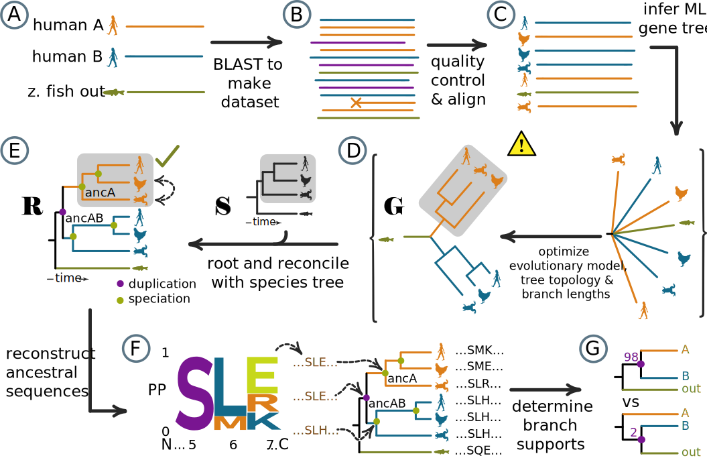

.. role:: emph

.. role:: raw-html(raw)
    :format: html

.. include:: links.rst

.. _protocol-doc:

========
Protocol
========

This protocol takes users all the way from constructing a seed dataset through 
reconstructing ancestors. 

:emph:`Steps done by topiary`

:raw-html:` `
**The steps covered in this protocol are:**

1. :ref:`Create a seed dataset<define-the-problem-doc>`
2. :ref:`Generate a multiple sequence alignment from the seed dataset<generate-msa-doc>`
3. :ref:`Visually inspect and (possibly) edit the alignment<edit-msa-doc>`
4. :ref:`Infer evolutionary trees and ancestors<infer-tree-and-anc-doc>`
5. :ref:`Determine the branch supports on the reconciled tree<infer-reconciled-bootstraps-doc>`
6. :ref:`Interpret outputs and select ancestors<interpret-results>`

.. _define-the-problem-doc:

1. Create a seed dataset
========================

The most important task in an ASR study is defining the problem. What
ancestors do you want to reconstruct? What modern proteins are best
characterized and most relevant to interpreting the results with ancestors?
This requires expert knowledge of the proteins under study--it's not something
that can be automated.

The tree for a hypothetical protein family shows how one might approach the
problem. `Paralog <paralogs_>`_ A has some activity (denoted with a star);
paralog B does not. If we are interested in the evolution of the star activity,
we would likely reconstruct ancA and ancAB (arrows). We expect ancA was active
because all of its descendants are active; we expect ancAB was inactive because
only the A paralogs--not the B paralogs or fish proteins--are active.
Reconstructing ancA and ancAB would thus isolate the key sequence differences
that conferred activity.

.. image:: _static/img/define-the-problem.svg
  :align: center
  :alt: Defining the problem on an evolutionary tree
  :width: 80%

:raw-html:` `
Two pieces of information specify the scope of the ASR study and thus what
ancestors can be reconstructed:

#. What homologs are of interest?
#. What homologs exist in what organisms?

We can think of the answers to these questions graphically. The image below
shows the information from above in a different format. The protein family is shown
left to right (proteins A-D); the species tree is shown from top to bottom
(humans through lampreys). The blue checks and orange exs indicate whether the
organism has the protein. To reconstruct ancA and ancAB, we need to know we want
to study proteins *A* and *B* (paralogs of interest) and we need to know that
bony vertebrates, but not other animals, have the A and B proteins
(*taxonomic scope*). The gray box indicates the proteins we need to include in
our ASR study to reconstruct ancA and ancAB.

.. image:: _static/img/project-scope.svg
  :align: center
  :alt: Defining the scope for an ASR project
  :width: 80%

:raw-html:` `
In a topiary calculation, we specify that these are the proteins of interest
using a seed dataset. In graphical terms, this means finding sequences
representing all paralogs (across horizontal) taken from the full taxonomic
scope (the top and bottom of the gray box).

.. note::
  Because the bacterial species tree is poorly defined, topiary will automatically
  use a taxonomic scope including all bacteria for datasets containing only
  bacterial proteins. 

---------------------------------------
Prepare a seed dataset as a spreadsheet
---------------------------------------

A seed dataset defines the paralogs of interest and taxonomic scope for a
reconstruction. It has four columns: name (e.g. the paralog), aliases, species,
and sequence. Topiary uses this dataset as a starting point for BLAST searches
to construct a dataset and generate an alignment for the reconstruction study.
An example for the two immune proteins, LY86 and LY96, is shown below. The full
spreadsheet can be `downloaded here <_static/data/seed-dataframe_example.csv>`_.

+------+--------------------------------------------------------------------------------------------+---------------+------------+
| name | aliases                                                                                    | species       | sequence   |
+------+--------------------------------------------------------------------------------------------+---------------+------------+
| LY96 | ESOP1;Myeloid Differentiation Protein-2;MD-2;lymphocyte antigen 96;LY-96                   | Homo sapiens  | MLPFLFF... |
+------+--------------------------------------------------------------------------------------------+---------------+------------+
| LY96 | ESOP1;Myeloid Differentiation Protein-2;MD-2;lymphocyte antigen 96;LY-96                   | Danio rerio   | MALWCPS... |
+------+--------------------------------------------------------------------------------------------+---------------+------------+
| LY86 | Lymphocyte Antigen 86;LY86;Myeloid Differentiation Protein-1;MD-1;RP105-associated 3;MMD-1 | Homo sapiens  | MKGFTAT... |
+------+--------------------------------------------------------------------------------------------+---------------+------------+
| LY86 | Lymphocyte Antigen 86;LY86;Myeloid Differentiation Protein-1;MD-1;RP105-associated 3;MMD-1 | Danio rerio   | MKTYFNM... |
+------+--------------------------------------------------------------------------------------------+---------------+------------+

Determine what sequences to include
-----------------------------------

#. :emph:`Choose the paralogs of interest for your ASR calculation.` As
   described above, the choice of paralogs determines what evolutionary
   transitions you will reconstruct. In our experience, you'll want to select
   ~1-5 paralogs in your seed dataset. As you add more paralogs, you need more
   sequences to resolve the evolutionary tree, making the calculation
   progressively slower. In the example seed dataset, we selected two paralogs,
   LY86_ and LY96_.
#. :emph:`Determine the taxonomic distribution of the protein family.` In the
   graphic above, this means identifying the vertical boundaries of the gray
   box: which creatures have these proteins? This information is often available
   through literature searches. The goal is to to identify the most
   evolutionarily distant groups of organisms that the proteins of interest.
   For more details on how to determine which organisms have your protein, see 
   :ref:`this page<taxonomic-scope-doc>`. 
#. :emph:`Choose two or three species with well-annotated genomes` that span the
   taxonomic distribution of your proteins of interest. In the graphic above,
   this means selecting species from the top and bottom of the gray box. The
   human and zebrafish proteins would be a good choice, as they have
   well-annotated genomes and span the diversity of organisms with the proteins
   of interest. (Contrast this to selecting humans and chickens, which would only
   include amniote proteins). The NCBI BLAST "Taxonomy" report from the
   :ref:`exploratory BLAST<taxonomic-scope-doc>` page can be helpful
   in this regard: select organisms that differ at the highest level of the
   reported hierarchy.

Construct the seed spreadsheet
------------------------------

The seed dataset is a spreadsheet that can be prepared in a spreadsheet program
(Excel or LibreOffice), a text editor, or programmatically via
`pandas <pandas-link_>`_. For technical details on the format of this dataframe,
see the `documentation <data_structures.html#topiary-dataframe>`_. 

#. :emph:`Download sequences for each paralog` from each species and put it into
   the table. Our usual source for these seed sequences is uniprot_. Generally,
   you'll want the `canonical <uniprot-canonical_>`_ sequence rather than an
   isoform. These sequences can come from anywhere; they do not even have to be
   from a database.
#. :emph:`Compile a list of aliases for each paralog`. Annoyingly, the same protein
   can have different names across different databases/species. By using a
   human-curated list of aliases, topiary is more effective at identifying
   sequences that really correspond to the paralogs of interest. When creating
   this list:

   + separate different aliases with "`;`"
   + aliases are case-insensitive (i.e. :code:`MD2`, :code:`md2`, and
     :code:`Md2` are equivalent)
   + topiary automatically tries different separators. For example, for :code:`MD2`
     topiary will look for :code:`MD2`, :code:`MD 2`, :code:`MD-2`, :code:`MD_2`,
     and :code:`MD.2`. It inserts separators between letters and numbers or any
     time there is a space/separator in the alias.
   + make sure to include both the abbreviated and full-length versions of each
     alias (i.e. :code:`MD2` and :code:`myeloid differentiation protein 2`).

   To find aliases, you can check out the "`Also known as`_" field for the gene of
   interest on NCBI, the "`Protein names`_" section of the protein's UniProt
   entry, a "genecards_" entry (for proteins found in humans), and/or primary
   literature.

#. You can put other information about the sequences (accession, citations, etc.)
   as their own columns in the table. Topiary will ignore, but keep, those
   columns.
#. If you would like to make sure to include specific sequences in the analysis,
   you can also add them to the seed dataset. (For example, you might want to
   make sure an experimentally characterized protein from a specific organism is
   in the final tree). To do so, add the the sequence to the dataset like any
   other, then add a fifth column: :code:`key_species`. Each sequence in the
   spreadsheet should either have :code:`True` or :code:`False` in this column.
   Those with :code:`True` will be used as part of the seed dataset; those
   with :code:`False` will not be used as seeds, but will be kept in all
   downstream steps in the analysis. In the following table, we added the mouse
   sequences to the dataframe as sequences that will be in the final tree but 
   will not be used as seeds for BLAST etc.

   +------+-----------------------+---------------+------------+-------------+
   | name | aliases               | species       | sequence   | key_species |
   +------+-----------------------+---------------+------------+-------------+
   | LY96 | ESOP1;Myeloid Diff... | Homo sapiens  | MLPFLFF... | True        |
   +------+-----------------------+---------------+------------+-------------+
   | LY96 | ESOP1;Myeloid Diff... | Danio rerio   | MALWCPS... | True        |
   +------+-----------------------+---------------+------------+-------------+
   | LY86 | Lymphocyte Antigen... | Homo sapiens  | MKGFTAT... | True        |
   +------+-----------------------+---------------+------------+-------------+
   | LY86 | Lymphocyte Antigen... | Danio rerio   | MKTYFNM... | True        |
   +------+-----------------------+---------------+------------+-------------+
   | LY86 | Lymphocyte Antigen... | Mus musculus  | MKTFFNM... | False       |
   +------+-----------------------+---------------+------------+-------------+
   | LY96 | ESOP1;Myeloid Diff... | Mus musculus  | MLSFVYF... | False       |
   +------+-----------------------+---------------+------------+-------------+

.. _generate-msa-doc:

2. Generate a multiple sequence alignment from the seed dataset
===============================================================

This step uses the seed sequences as BLAST queries to identify homologs, 
performs reciprocal BLAST to call the the orthology of the hits, lowers dataset
redundancy in an intelligent fashion, and generates a sequence alignment. 
The steps, as well as output files, are described in detail on the 
:any:`pipelines page <align-script-details>`. 

To run this step, use the following command, replacing *seed-dataframe_example.csv*
with the name of your seed file.

.. code-block:: shell-session

  topiary-seed-to-alignment seed-dataframe_example.csv --out_dir seed_to_ali

.. note::

  This can also be run in a Jupyter notebook. For an example, see 
  `here <https://github.com/harmslab/topiary-examples/blob/main/notebooks/seed-to-alignment.ipynb>`_. 
  To run this notebook interactively in Google Colab, click the button below. 

  .. image:: https://colab.research.google.com/assets/colab-badge.svg
    :align: center
    :alt: open seed to alignment in colab
    :target: https://githubtocolab.com/harmslab/topiary-examples/blob/main/notebooks/seed-to-alignment.ipynb

------
Output
------

This will create a directory named *seed_to_ali* that has a set of
csv files that sequentially capture each step in the topiary pipeline, as
well as intermediate files used in the calculation. When topiary removes a 
sequence from consideration, it sets the spreadsheet column :code:`keep` to 
:code:`False`,  so you can track how the dataset changes over steps by looking
at these spreadsheets. 

.. tip::

  If you want to override topiary's decision to remove a sequence, you can
  manually set the :code:`keep` and :code:`always_keep` columns to :code:`True`
  in one of the intermediate spreadsheets. Delete the subsequent spreadsheets
  and then re-run the pipeline with the :code:`--restart` argument described
  above. That sequence will now be kept regardless of quality score or 
  redundancy.

The outputs used for the next step are *seed_to_ali/05_clean-aligned-dataframe.csv* 
and *seed_to_ali/06_alignment.fasta*. The final csv file is a topiary dataframe
that has only the final sequences and information about them. The fasta file
holds the final alignment. 

.. note::

  Generally, this script should take less than an hour. The time required for
  the initial NCBI BLAST step depends on server capacity and may take a while.
  Unfortunately, this is outside of topiary's control. If this step is too slow
  or crashes, you can load in sequences from saved BLAST XML files using the 
  `--blast_xml` argument to `topiary-seed-to-alignment`.

-------
Options
-------

There are many options available for this function. These can be accessed by:

.. code-block:: shell-session

  topiary-seed-to-alignment --help

Some of the more common options users might wish to change are listed below.

:emph:`Controlling alignment size`

The :code:`--seqs_per_column` and :code:`--max_seq_number` arguments control
how many sequences topiary will attempt to place in the final alignment.  By
default, topiary will attempt to have one sequence per amino acid in the
average seed sequence (:code:`--seqs_per_column 1`). For example, if your
average seed is 200 amino acids long, it will  aim for 200 sequences in the
alignment. This can be changed by changing the value of :code:`--seqs_per_column`.
The maximum alignment size is set by :code:`--max_seq_number`. Note that these
values are approximate; the final alignment may be slightly larger or smaller.

:emph:`Choosing different BLAST inputs`

You can select different BLAST inputs via the :code:`--blast_xml`,
:code:`--ncbi_blast_db`, and :code:`--local_blast_db` options. Any combination
of these options may be specified at the same time, allowing a single command to
BLAST against an NCBI database, BLAST against a local BLAST database, and
load results from a collection of previously saved BLAST XML files. The
:code:`--blast_xml` option is particularly useful, as you can save NCBI BLAST
results from the web interface (for example) and read those files in directly.

:emph:`Restarting`

You can restart a command from an existing directory using a command like the
following:

.. code-block:: shell-session

  topiary-seed-to-alignment seed-dataframe_example.csv --out_dir seed_to_ali --restart

This will find the last completed step in the pipeline and will restart the
pipeline from there.

.. _edit-msa-doc:

3. Visually inspect and (possibly) edit the alignment
=====================================================

Before reconstructing a phylogenetic tree and ancestors, we recommend
inspecting and possibly editing the alignment. We recommend using
`Aliview <aliview-link_>`_ for this purpose.

.. danger::
  Topiary will give you the best-aligning set of sequences given the BLAST 
  results, but it does not assess absolute alignment quality. If the sequences
  are so divergent that they cannot be aligned reliably, the downstream 
  ASR steps will not be successful. Things to look for are protein regions with
  variable lengths and sequences (such as loops and extensions) as well as
  highly divergent sequences where there is no clear shared set of amino acids 
  with other sequences. Ancestral sequences for such regions will be impossible 
  to reconstruct with confidence. 

There are differing views on whether or not to manually edit an alignment.
Manual edits are subjective, but there are also "obvious" instances where
automatic alignment software does poorly. We usually edit our alignments using
the following protocol.

:emph:`If you modify your alignment manually, it should be included in any
publication so others can reproduce/evaluate your work.` We recommend including
the final topiary *.csv* file as a supplemental file with your manuscript, as
this has all sequence accessions and the final alignment in a single table.

.. danger::

  When editing the alignment, do not change the names of the sequences as this
  is how topiary maps the alignment back into the dataframe. Likewise, do not
  add sequences to the alignment. (To add sequences, you should add them to the
  dataframe itself before writing out the alignment.)

:emph:`Trim variable-length N- and C-terminal regions from the alignment`.
A huge number of sparse and variable columns will slow evolutionary analyses and
will generally not provide enough signal to be reconstructed with confidence.

.. image:: _static/img/manual-alignment/trim-terminal.png
  :align: center
  :alt: Trim long N- and C-terminal extensions from alignment
  :width: 600

:raw-html:` `
:emph:`Delete sequences with long, unique insertions or deletions (indels)`.
Indels can lead to alignment ambiguity around flanking regions. Further, they
provide no information for most ancestors, most of whom do not have the indel,
while increasing the computational cost of the phylogenetic analysis. Note,
do not make internal edits to sequences (say, by deleting a long
lineage-specific insertion) as this becomes difficult to track or justify upon
future realignment steps.

.. image:: _static/img/manual-alignment/delete-with-indel.png
  :align: center
  :alt: Delete sequences with long insertions or deletions
  :height: 300

:raw-html:` `
:emph:`Delete lineage-specific duplicates.` Select the sequence with the
greatest sequence coverage. The pipeline generally does a good job of deleting
sequences in this class; however, if such sequences slip through, delete them
from the alignment.

.. image:: _static/img/manual-alignment/delete-isoforms.png
  :align: center
  :alt: Delete nearly identical, partial sequences from the same species
  :height: 300

:raw-html:` `
:emph:`Globally realign the sequences`. Because trying to align long and
variable sequences like those we deleted above can affect the alignment of
other sequences, we generally use Muscle5 to re-align the entire dataset
after we remove problematic sequences and columns. Alignment can be done directly
within AliView. We often iterate through the steps above and full realignment
several times.

:emph:`Carefully inspect the alignment and correct "obvious" local misalignments`.
Shift characters, without deleting characters, to correct identical or nearly
identical regions that are misaligned. This can occur at the edges of insertions
and deletions.

.. image:: _static/img/manual-alignment/manual-moves.png
  :align: center
  :alt: Manually clean up obviously poorly aligned regions
  :height: 300

:raw-html:` `
Once you are satisfied with the alignment, save it out as a .fasta file from
your alignment editor.

-------------------------------------------
Load the final alignment into the dataframe
-------------------------------------------

Once you have edited the alignment, load the new alignment back into a new,
final topiary dataframe.

.. code-block:: shell-session

  topiary-fasta-into-dataframe 05_clean-aligned-dataframe.csv edited_alignment.fasta final_dataframe.csv

In this command, :code:`edited_alignment.fasta` should be the name of the fasta
file you saved out above. :code:`final_dataframe.csv` is the name of the final
csv file. The file :code:`final_dataframe.csv` can then be used for all 
subsequent reconstruction steps. 

.. _infer-tree-and-anc-doc:

4. Infer evolutionary trees and ancestors
=========================================

This step will do five tasks: 

+ Infer the maximum likelihood model of sequence evolution
+ Infer a maximum likelihood gene tree
+ Infer ancestors on the maximum likelihood gene tree
+ Generate bootstrap replicates for the maximum likelihood gene tree
+ Reconcile the gene and species trees (for non-microbial proteins)

The input for this calculation is the *.csv* file from the last step. A small
example input file can be found `here <_static/data/ali-to-anc-example-dataset.csv>`_. 
This dataset will take about an hour to run on a laptop. 

We highly recommend running the this analysis on a computing cluster. To
prepare the computing environment, please :ref:`install topiary<installation-doc>`
on the cluster. The following instructions assume you installed topiary in a
conda environment named `topiary`.

.. note::

  You can run this as a Jupyter notebook instead of using the command line. 
  For an example, see `this notebook <https://github.com/harmslab/topiary-examples/blob/main/notebooks/alignment-to-ancestors.ipynb>`_. 
  To run this notebook interactively (for a toy dataset) on Google Colab,
  click the button below. 

  .. image:: https://colab.research.google.com/assets/colab-badge.svg
    :align: center
    :alt: open seed to alignment in colab
    :target: https://githubtocolab.com/harmslab/topiary-examples/blob/main/notebooks/alignment-to-ancestors.ipynb

Copy the final dataframe up to the cluster.

.. code-block:: shell-session

  scp final_dataframe.csv username@my.cluster.edu:

Running topiary on a cluster will require a run file that specifies the
resources available for the calculation. The following is an example SLURM
script for our local cluster. (Check with your cluster administrator for the
relevant format.)

.. code-block:: shell-session

  #!/bin/bash -l
  #SBATCH --account=harmslab
  #SBATCH --job-name=topiary
  #SBATCH --output=hostname.out
  #SBATCH --error=hostname.err
  #SBATCH --partition=long
  #SBATCH --time=07-00:00:00
  #SBATCH --nodes=1
  #SBATCH --ntasks-per-node=28
  #SBATCH --cpus-per-task=1

  # Activate the topiary conda environment
  conda activate topiary

  topiary-alignment-to-ancestors final_dataframe.csv --out_dir ali_to_anc --num_threads 28

The key aspects to note in this file are:

+ The number of threads should match between the topiary call
  (:code:`--num_thread 28`) and the cluster resource allocation
  (:code:`#SBATCH --ntasks-per-node=28`).
+ This script should be run on a single physical processor
  (:code:`#SBATCH --nodes=1`). This is because the conda version of RAxML-NG is
  not compiled to parallelize across multiple processors.
+ We've found that this step usually takes a few days for an alignment with ~500
  sequences and ~1000 columns. We conservatively allocated a week
  (:code:`#SBATCH --time=07-00:00:00`).
+ If you installed topiary using conda (as we recommend), you  need to make sure
  that the conda environment is active (:code:`conda activate topiary`).

You start the topiary run using something like the following command. This
is for SLURM on our cluster; check with your administrator for the appropriate
command on your system.

.. code-block:: shell-session

  sbatch launcher.srun

------
Output
------

The output for this call is a directory (*ali_to_anc* from command above).
The primary output is *ali_to_anc/results/index.html*. This file summarizes the 
results of the calculation. The *results* directory is a self-contained unit
that can be shared and opened by anyone, even if they do not have topiary
installed. The *ali_to_anc* directory will also have directories for each step
in the pipeline. For details about these directories and the functions called
in the pipeline, see the :any:`pipelines page<ali-to-anc-pipeline>`. 

-------
Options
-------

To see the options available for this function, type:

.. code-block:: shell-session

  topiary-seed-to-alignment --help

Some of the more important options are:

+ :code:`--restart`. This allows you to restart a partially completed job.
+ :code:`--force_reconcile` and :code:`--force_no_reconcile`. This will force the 
  gene tree and species trees to be reconciled, overriding the default. (The 
  default is to not reconcile for microbial datasets and to reconcile for 
  non-microbial datasets). 
+ :code:`--horizontal_transfer`. This selects whether reconciliation will
  allow horizontal transfer of genes. By default, this is not allowed. This is
  only meaningful if the gene and species trees are being reconciled. 

.. _infer-reconciled-bootstraps-doc:

5. Determine the branch supports on the reconciled tree
=======================================================

This step determines the branch supports on the reconciled tree. This step
is separate from the previous step, as is is relatively computationally intensive
and benefits from a different parallelization strategy than the last step. This
step only needs to be done if you reconciled the gene and species tree in the
previous step. 

.. important::

  This step is computationally intensive. Before proceeding, we recommend 
  checking the results from the last steps to ensure they are reasonable. See the
  :ref:`Interpret the results <interpret-results>` section for details.

As with the last step, create a run file that specifies the resources available
for the calculation. The following is an example SLURM script for our local
cluster.

.. code-block:: shell-session

  #!/bin/bash -l
  #SBATCH --account=harmslab
  #SBATCH --job-name=topiary
  #SBATCH --output=hostname.out
  #SBATCH --error=hostname.err
  #SBATCH --partition=long
  #SBATCH --time=07-00:00:00
  #SBATCH --nodes=5
  #SBATCH --ntasks-per-node=28
  #SBATCH --cpus-per-task=1

  # Activate the topiary conda environment
  conda activate topiary

  topiary-bootstrap-reconcile ali_to_anc 140

The key aspects to note in this file are:

+ Unlike the last script, this script can be run across more than one physical
  processor (:code:`#SBATCH --nodes=5`).
+ The number of threads should match between the topiary call
  (:code:`140`) and the cluster resource allocation
  (:code:`#SBATCH --nodes=5`, :code:`#SBATCH --ntasks-per-node=28`). 
  :math:`5 \times 28 = 140`. This will run in highly parallel fashion, with one
  reconciliation bootstrap per thread.
+ We've found that this step usually takes about a week for an alignment with ~500
  sequences and ~1000 columns long. We allocated a week
  (:code:`#SBATCH --time=07-00:00:00`).
+ If you installed topiary using conda (as we recommend), you need to make sure
  that the conda environment is active (:code:`conda activate topiary`).

You start the topiary run using something like the following command. This
is for SLURM on our cluster; check with your administrator for the appropriate
command on your system.

.. code-block:: shell-session

  sbatch launcher.srun

------
Output
------

When completed, this pipeline will update the *ali_to_anc/results* directory, 
adding branch support information to the reconciled tree and reconciled
ancestors. For details about the outputs and functions called in the pipeline,
see the :any:`pipelines page<bootstrap-reconcile-pipeline>`. 

-------
Options
-------

To see the options available for this function, type:

.. code-block:: shell-session

  topiary-bootstrap-reconcile --help

The most important option is:

+ :code:`--restart`. This allows you to restart a partially completed job.

.. _interpret-results:

6. Interpret outputs and select ancestors
=========================================

.. danger::

  Generating ancestors is relatively easy, but experimentally characterizing
  them can take years; it is worth making sure the ancestors are well 
  reconstructed before ordering genes!

The output from the *alignment-to-ancestors* and *bootstrap-reconcile* pipelines
will be in the *results* directory. (This directory is also automatically
compressed to *results.zip* for easy downloading). Open *results/index.html* 
in a web browser. There are "Help" icons throughout this page to help you 
navigate the output. 

---------------
Quality metrics
---------------

**The first quality metric to consider is the average posterior probability (PP)
for the ML amino acid** at all positions in the ancestor. A well reconstructed
ancestor would have an average PP of 1.0, meaning the model has high confidence
in the sequence at all sites. At the other extreme, a completely ambiguous
ancestor would have an average PP of ~1/20 (0.05), meaning each site could have
any one of the amino acids. Generally, ancestors in published studies have
average PP for the ML reconstructed states > 0.85. 

To assess the effect of phylogenetic uncertainty on inferences about the
functions of ancestors, we recommend synthesizing two versions of every ancestor.
The first is the ML ancestor, as described above. The second is the altAll
ancestor. For the altAll ancestor, we replace all ambiguous ML amino acids
with the next-most-probable amino acid. If an ancestor has 10 ambiguous sites,
the ML and altAll would differ at all 10 of these sites. By functionally
characterizing both the ML and altAll versions of an ancestors, we can determine
which features are robust to uncertainty in the reconstruction.

A similar sensitivity analysis can be performed if their are ambiguous gaps in 
the sequence. Topiary does not generate an altAll sequence for gaps; however, 
ambiguous gaps can be identified by looking in the csv file linked off the 
ancestor summary page. 

**The second quality metric is the branch support for a given ancestral node.**
Posterior probabilities measure our confidence in the ancestral sequence given a
particular phylogenetic tree, but they do not measure our confidence in the tree
itself. (Put another way, we have the sequence of an ancestral node, but how
confident are we that the node existed?) Branch supports measure this
confidence. 

A branch support measures our confidence that a given group of sequences cluster
together, typically on a 0-100 scale. The figure shows branch supports for two
possible arrangements of the tree: placing paralog A with B (orange with blue)
or paralog B with the fish outgroup (blue with green). In this example we have
high support (98/100) for placing paralogs A and B together, with contrasting
low support for separating them (2/100). For an ASR study, we need to have high
confidence that an ancestral node existed (typically branch support > 85) prior
to characterizing the ancestral protein. 

---------------
Model violation
---------------

In addition to checking the posterior probability and branch supports, it is 
important to make sure the tree topology is reasonable. 

The probabilistic models used in ASR are powerful, but do not capture all
possible evolutionary events. One common problem is incomplete lineage sorting
(ILS), where a gene duplicates but exists as several variants in a population
when speciation occurs. Different duplicates are preserved along the
descendant lineages, meaning this cannot be classified as a simple duplication
or speciation event. ILS is a general problem with all ASR methods and is
specifically noted as being outside the scope of GeneRax (the software topiary
uses for gene/species tree reconciliation). 

Another problem is gene fusion, where different parts of a single gene have
different evolutionary histories. The methods used by topiary all assume a
single genetic history for each protein sequence. If we force such a model to
fit a fused alignment, we will likely end up with a nonsensical evolutionary
tree and meaningless ancestral sequences. 

A standard signal for both ILS and gene fusion is high discordance between the
inferred gene and species trees. This manifests as an unexpectedly high
number of duplication and/or transfer events in the reconciled tree. If, for
example, you are studying a protein family where you expect two paralogs, but
you observe 20 duplication events scattered throughout the tree, there is a good
chance that the evolutionary models used for ASR are not appropriate for your
protein family. 

**If topiary detects discordance, it will place a warning in the 
results for the reconciled tree.** 

Excess duplications could be observed for benign reasons. The first is
lineage-specific duplication, where one or more organisms has more than one copy
of a given gene. These will appear as recent duplications near the tips of the
tree. The second benign reason would be previously unrecognized gene 
duplication(s). This will appear as a duplication with taxonomically reasonable
descendants. For example, if a gene duplicated in the ancestor of humans, chimps,
and gorillas, we would see human/chimp/gorilla on both sides of the duplication
event (i.e., six total sequences). 

If these conditions are not met, it is likely that model violation is in play. 

If your protein has more than one domain, one option would be to try to
reconstruct each domain independently. If the discordance disappears, it's good
evidence for a gene fusion event. If the discordance remains, proceed with
extreme caution. 

Another way forward in the face of discordance is to compare the sequences--and
functional characteristics--for any ancestors of interest reconstructed using
either the reconciled gene tree and on the gene tree alone. If the results for
ancestors reconstructed on the two trees differ dramatically, one cannot infer
the ancestral sequence with confidence given standard ASR methods. If the results
for the reconstructions on both trees are similar, it suggests whatever features
you are trying to reconstruct are robust to uncertainty in the tree topology. 
Topiary warns users in its summary output if there are an anomalous number of
duplication events, suggesting model-violation. 

